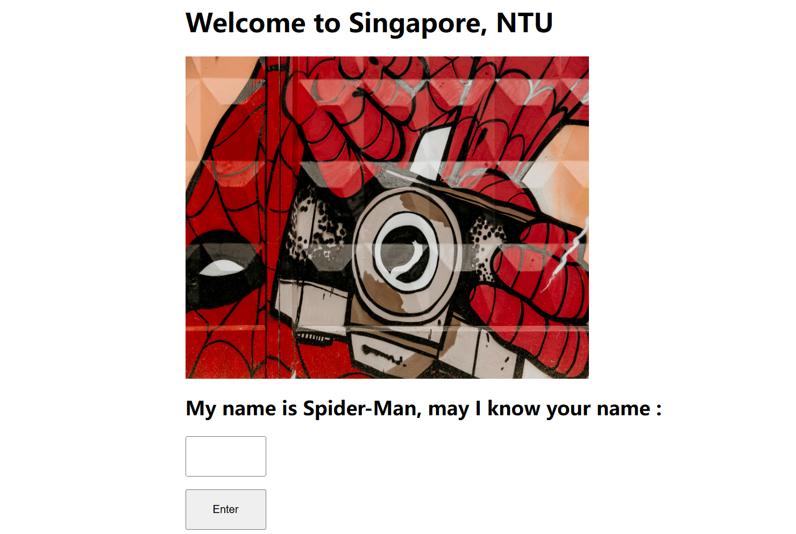
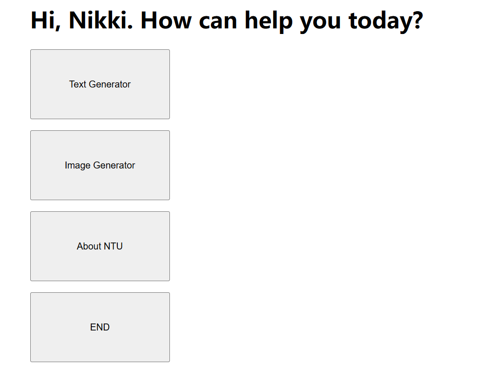
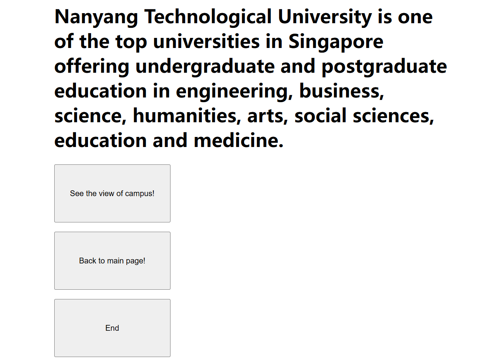
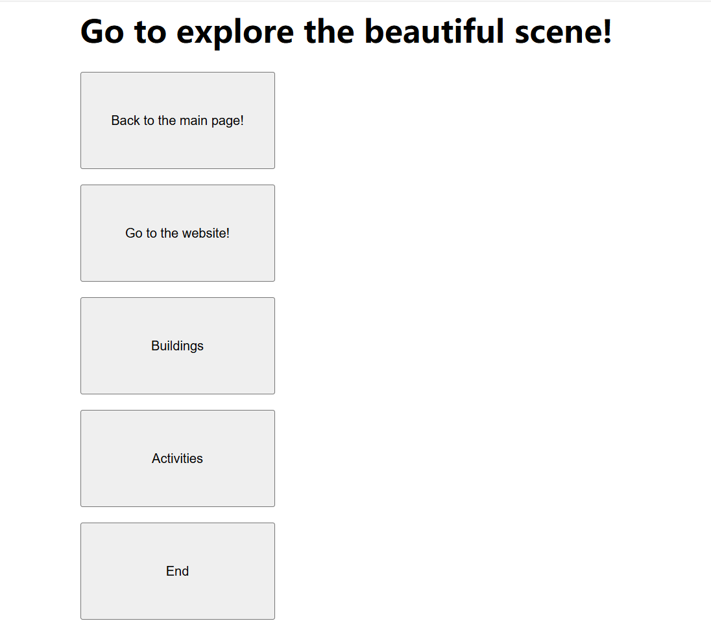
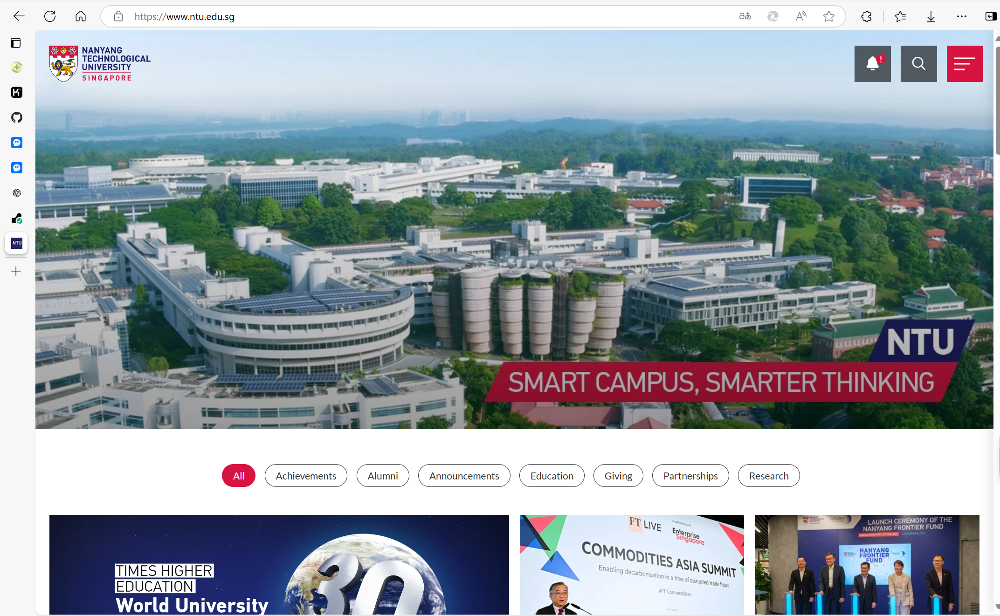
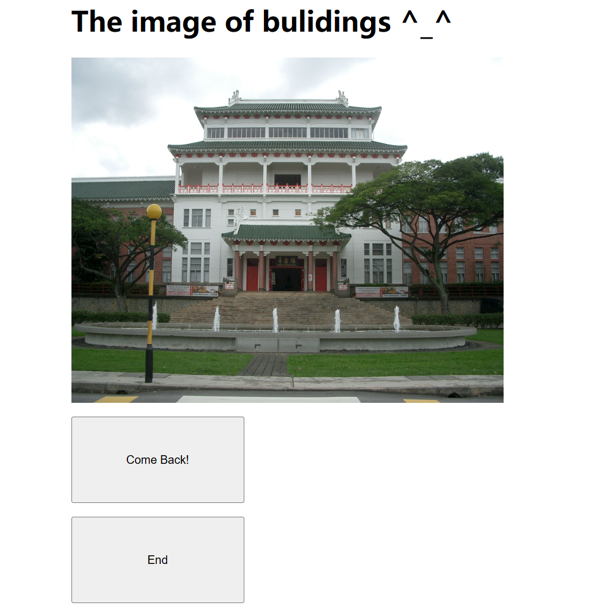
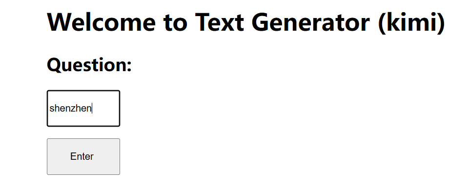
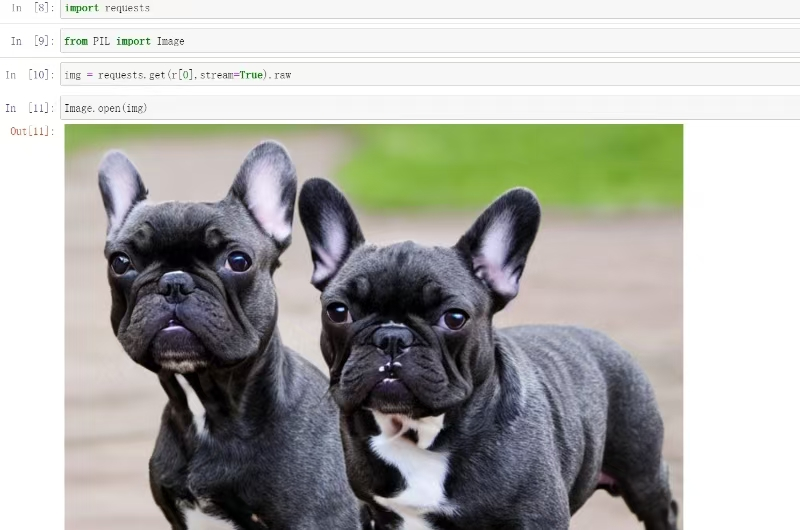

# Flask AI文本及图片生成网站 with NTU project

## 概述
这个 Flask 应用程序旨在与各种 API 进行交互，包括聊天机器人 API 和图像生成 API，以提供动态和互动的用户体验。该应用程序由多个路由组成，处理不同的用户请求和响应。

## 特性
- **聊天机器人交互**：用户可以与由 Kimi API 支持的聊天机器人进行基于文本的对话。
- **图像生成**：用户可以输入提示词，使用 replicate API 和 Stable Diffusion 模型生成图像。
- **模板渲染**：应用程序使用 Flask 的 `render_template` 函数来服务 HTML 模板，提供清晰友好的用户界面。

## 先决条件
在运行应用程序之前，请确保已安装以下先决条件：

- Python 3.x
- Flask
- requests
- replicate（用于图像生成）

您可以使用 pip 安装所需的包：

```bash
pip install Flask requests replicate
```

## 环境变量

应用程序需要设置以下环境变量：

- `REPLICATE_API_TOKEN`：用于访问图像生成模型的 Replicate API 令牌。
- `Authorization`：Kimi 聊天机器人 API 的 API 密钥。

在操作系统中设置这些环境变量，或直接在代码中传递。

## 运行应用程序

为了运行该应用程序，通过Render平台将其上传至云。

这将启动 Flask 开发服务器，运行live后，应用程序将在https://rpa-feb192024-jhy.onrender.com 上可访问。

运行效果如下所示。










## 路由

以下是路由及其功能的详细说明：

- `/`：首页路由，渲染 `index.html` 模板。
- `/main`：主交互路由，处理表单提交并渲染带有聊天机器人响应的 `main.html` 模板。
- `/image_gpt`：图像生成路由，渲染 `image_gpt.html` 模板。
- `/image_result`：处理图像生成请求，调用 replicate API，并渲染带有生成图像的 `image_result.html` 模板。
- `/text_gpt`：基于文本的聊天机器人交互路由，渲染 `text_gpt.html` 模板。
- `/text_result`：处理聊天机器人请求，调用 Kimi API，并渲染带有聊天机器人响应的 `text_result.html` 模板。
- `/text_ntu`, `/image_ntu`, `/building_ntu`, `/activities_ntu`, `/website_ntu`：与 NTU（南洋理工大学）相关的特定功能的额外路由。
- `/end`：结束路由，重置 `first_time` 变量并渲染 `end.html` 模板。

## 注意事项

- 应用程序使用全局变量 `first_time` 来跟踪初始表单提交。
- `get_response_from_kimi` 函数是 `requests` 库的包装器，用于与 Kimi API 交互。
- `image_result` 函数包括 `time.sleep(5)` 以等待图像生成过程完成。这是一个简单的实现，可能需要在生产使用中替换为更健壮的解决方案。
- 应用程序假设 HTML 模板位于与 Flask 应用程序相同目录下的 `templates` 目录中。

## 安全和隐私

请确保您的 API 密钥和令牌安全，不要在代码或版本控制系统中暴露。使用环境变量或安全库来管理敏感信息。

## 许可证

该应用程序是开源的，可以在 MIT 许可证的条款下使用和修改。
